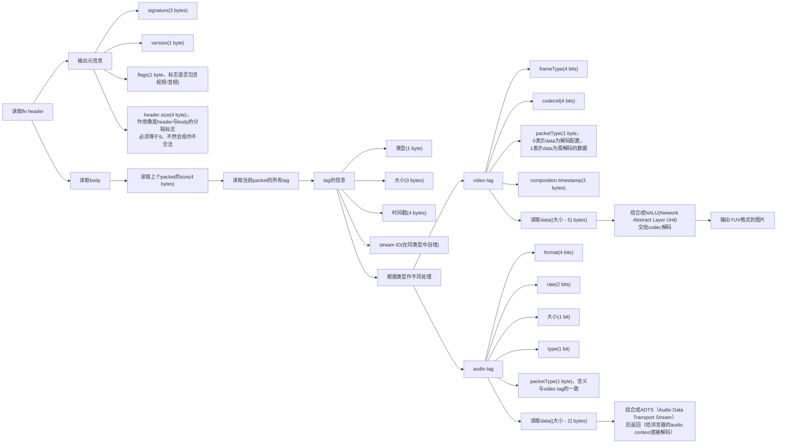

## 前言
前段时间公司需要做视频流的展示，视频流采用的是`flv`文件格式和`h.265`编码格式。

因为浏览器不支持`flv`并且一般也不支持直接播放`h.265`编码的视频，所以最终使用了[`WXInlinePlayer`](https://github.com/ErosZy/WXInlinePlayer)来实现视频的播放。

## 正文
因为`h.265`的解码十分消耗`CPU`的资源，所以想去了解`flv`视频流底层一点的知识，再进一步找到优化的方案。

于是就去查看了`WXInlinePlayer`里`C++`实现的`demuxer`相关的代码，于是整理了如下的流程图来说明`flv`格式解包。





## 总结
实际上`flv`是`视频`和`音频`数据的容器，包含很多个`音视频`的数据包，对它们进行拆分后需交给对应的解码器解码。
`flv`直播流本质应该跟读取大文件类似，会从直播的视频数据某个位置截取作为文件的开头返回给客户端；
另一方面浏览器会创建的长连接会不断地拉取文件下一部分的新数据。
`mp4`跟`flv`一样也是`音视频`数据的容器，只是浏览器原生支持其播放，`flv.js`做的工作实际上是`demux(解包) flv`后再`remax(组装)`成`mp4`，再`feed`给`mse`进行播放。