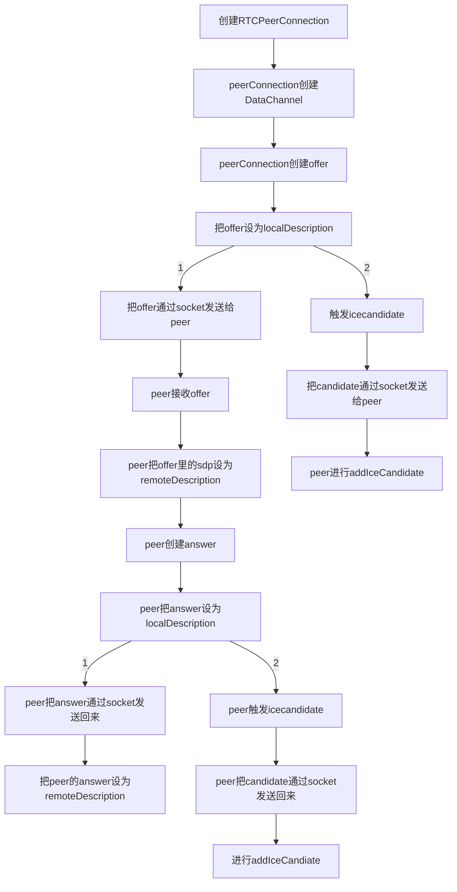

## 前言
这个星期碰到公司同事有项目是需要做对讲功能，但听说一直以来都是调用的第三方`SDK`。听到这类需求首先想到是`webRTC`相关的开发。

虽然之前有过一段时间想去了解，但碍于`webRTC`里出现的概念对于传统的`web`开发来说比较陌生以及也没有实际的开发需要，所以中途都放弃了。

但未来可能会有这种需求，那就借此机会来稍微弄清`webRTC`是建立`P2P`的连接的机制。

## 正文

### 流程图
以下是根据`peerjs`源码，梳理的`webRTC`在建立连接时的流程图：





### 术语：
1. `transport address`在`RFC`文档中指代`ip`地址和`port`
2. `STUN(Session Traversal Utilities for NAT)`服务器的主要作用是帮助`client`获取其对应的经`NAT`转换后的`public transport address`
3. `TURN(Traversal Using Relays Around NAT)`服务器的主要作用是给`peerA`，分配一个`relayed transport address`，让`peerB`通过发送数据到这个地址后，`TURN`服务器再转发给`peerB`。`TURN`可以解决`STUN`无法处理的`Symmetric NAT`类型。
4. `Symmetric NAT`是指`NAT`会因请求方的`transport address`或接收方的`transport address`不同，而给请求方映射不同的`public transport address`。因为目标地址不一，所以`peerB`不能使用与`STUN`服务器收到的`server-reflexive transport address`相同的地址与`peerA`通信。

### 需要`signaling`服务的原因
由于`RTCConnection`未建立前并不知道对方的`transport address`，所以需要开发者先通过任意`signaling`服务作中介（服务的实现方式不作限定，常见的是通过`websocket`）来交换各自`session description`和`ice candidate`。

### sd格式
`session description`包含己方将要传输的媒体信息（地址、端口、格式等），是一个多行`key=value`格式的文本。

### `STUN/TURN`服务器的作用
在`setLocalDescription`后，会请求`STUN/TURN`服务器来获得`peer`可以直接通信的`transport address`，生成`candidate`的配置后触发`icecandidate`事件，。把`candiate`通过`signaliing`服务发给`peer`，让对方把这个连接候选方式，添加到`peerConnection`中。

### `candidate`生成结束
当某一轮的`candidate`生成完毕后，`icecandidate`事件会回调一个空的`candiate`来标志生成完毕，如果连接建立成功`iceconnectionstatechange`，`peerConnection`的`iceConnectionState`会变为`connected`。

### `candidate`的类型：
1.`host`：直连，`peer`的真实地址
2.`srflx`：`server-reflexive`，发送`STUN Binding Request`到`STUN`服务器后，经`NAT`转换过的`public`地址
3.`prflx`：`peer-flexive`，发送`STUN Binding Request`到`peer`后，从`peer`获得的经`NAT`转换过的`public`地址
4.`relay`：`TURN`服务的中继地址

`webRTC`会按规则选取最优的`candidate`进行连接。

## 总结
本文只是简单地梳理了`webRTC`建立连接过程发生的事情，但也可以看到其实`webRTC`（先不论存在`relay`的情况）跟一般的`request/response`的模式差别不太大，服务方都会通过`server-reflexive`的`transport address`传数据给`client`，可能因为使用的是`udp`，实时性会更好些。所以如果只是单方面的视频推流，感觉是不太需要用到`webRTC`的，`webRTC`的主要使用场景应该是数据实时互传方面的。
